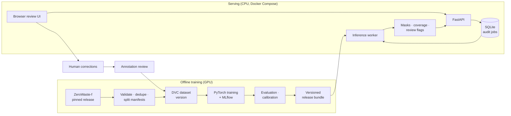

<div align="center">

# BeltWatch

**Visual contamination auditing for paper-recycling conveyor lines**

Semantic segmentation · visible-coverage estimation · uncertainty-aware review queue · auditable human feedback

[](https://github.com/professor3333/beltwatch/actions/workflows/ci.yml)
[](https://github.com/professor3333/beltwatch/actions/workflows/container.yml)
[](LICENSE)
[](https://ai.bu.edu/zerowaste/)


</div>

> [!NOTE]
> **Project status: system built; full-data training pending.** The complete
> pipeline is implemented, tested (215 tests), and checked on real ZeroWaste
> frames: data pipeline, baselines, U-Net and SegFormer training,
> calibration, evaluation, error analysis, the audit service and review UI,
> and the container deployment. No model has been trained on the full
> dataset yet, so this README reports **no results**. See [Status](#status).

## Architecture



## The problem

Paper-recycling streams contain materials that operators want removed:
**cardboard, soft plastic film, rigid plastic, and metal**. These are hard to
spot. Waste arrives crushed, folded, dirty, overlapping, and sometimes
translucent. A plastic bag can be almost invisible against paper, and printed
cardboard can look like the surrounding stream.

BeltWatch helps a quality technician decide **which inspection images deserve
attention** and shows the suspected material clearly. For each image it
answers:

- **What** material might be present?
- **Where** is it visible?
- **How much** of the inspected region does it occupy?
- **Does it need review?** This combines coverage, model uncertainty, and
  image quality.
- **What did the reviewer decide?** Each image keeps an append-only,
  versioned audit record.

### What BeltWatch measures, and what it does not

BeltWatch reports **estimated visible coverage**: the fraction of valid pixels
inside an operator-defined inspection region that the model assigns to each
material.

$$
\text{coverage}_c = \frac{\text{pixels predicted as material } c \text{ inside the region}}{\text{valid pixels inside the region}}
$$

It does **not** estimate contamination by weight, certify bale purity, or
prove that an image is clean. "Background" means "outside the four target
labels", not "verified clean paper".

## Workflow

1. Upload a batch of conveyor snapshots and draw the inspection region.
2. An asynchronous job validates the images and runs segmentation on CPU.
3. Per-material visible coverage and uncertainty are computed for each image.
4. A review queue ranks images. It prioritizes high coverage, reserves a share
   for uncertain cases, and adds a random sample of low-risk images to catch
   missed material.
5. The reviewer inspects overlays and confirms or corrects each finding.
6. BeltWatch exports an audit report with the model version and provenance.
7. Reviewed corrections become candidates for the next dataset version.

## Approach

| Role | Model |
|---|---|
| Sanity check | All-background prediction |
| Classical baseline | Random forest on color, gradient, and multiscale texture features |
| Deep-learning baseline | U-Net with an ImageNet-pretrained ResNet-18 encoder |
| Challenger | SegFormer-B0 with a five-class head |

The **primary metric is foreground macro IoU** over the four material
classes, so abundant background pixels can't inflate the score. Supporting
metrics:

- per-class IoU, precision, and recall
- visible-coverage MAE in percentage points
- recall versus review workload
- calibration error
- CPU latency and memory

Confidence intervals use a paired bootstrap over recording groups. A neural
model must clearly beat the *tuned* classical baseline to be adopted, and a
well-tuned U-Net is an acceptable winner.

Details: [design §9–§16](docs/design.md#9-model-strategy) and the
[model card](docs/model_card.md).

## Tech stack

| Area | Tools |
|---|---|
| Modeling | PyTorch, Hugging Face Transformers, scikit-learn, scikit-image |
| Data and experiments | DVC, MLflow, Pillow/OpenCV, NumPy |
| Serving | FastAPI, Pydantic, SQLite, a small HTML/JS frontend |
| Operations | Docker Compose, Prometheus, GitHub Actions |
| Optional optimization | ONNX Runtime, adopted only if benchmarks justify it |

## Status

| Component | Status |
|---|---|
| Pinned, checksummed, resumable download; validation and quarantine | Built and tested; checked on real archive data |
| Duplicate and leakage audit; official-repaired split policy | Built and tested; checked on real data |
| Shared preprocessing; mask conversion; augmentation | Built and tested; overlays checked on real frames |
| All-background and random-forest baselines | Built and tested; **full-data run pending** |
| U-Net (ResNet-18) and SegFormer-B0 training with MLflow | Built and tested; **GPU training pending** |
| Temperature-scaling calibration (overall and foreground ECE) | Built and tested; **fit on trained models pending** |
| Evaluation suite: foreground macro IoU, coverage MAE, review workload, group bootstrap | Built and tested |
| Error-analysis report and CPU benchmark | Built and tested; **runs on trained models pending** |
| Audit service: durable jobs, leases, retries, idempotency, append-only feedback, reports | Built and tested; exercised live |
| Review UI | Built; exercised in a headless browser |
| Versioned release bundles, activation, and rollback | Built; switch and rollback verified in CI |
| Docker Compose deployment (HTTPS proxy, API, worker, Prometheus) | Built; deployed and smoke-tested in CI |
| Ablations (loss, sampling, resolution) and 3-seed finalists | Not started (needs GPU) |
| Locked test-set evaluation of a declared release | Not started (after model selection on val) |
| Staged robustness dataset, usability study, hosted demo, ONNX/INT8 | Not started |

The full plan, targets, and Definition of Done are in
[`docs/design.md`](docs/design.md). The GPU steps are in the
[training runbook](docs/training.md).

## Data

BeltWatch uses **ZeroWaste-f** from Boston University and collaborators:
RGB frames from an operating paper-recycling conveyor with polygon labels for
cardboard, soft plastic, rigid plastic, and metal.

- Project: <https://ai.bu.edu/zerowaste/>
- Release: [Zenodo record 6412647](https://zenodo.org/records/6412647) (`zerowaste-f-final.zip`, about 7.5 GB)
- Paper: Bashkirova et al., [PMLR vol. 220](https://proceedings.mlr.press/v220/bashkirova23a/bashkirova23a.pdf)

> [!IMPORTANT]
> **License discrepancy.** The Zenodo record shows CC BY 4.0, while the
> project website and [repository](https://github.com/dbash/zerowaste) state
> CC BY-NC 4.0. BeltWatch treats the dataset as **attributed and
> noncommercial**. The dataset is downloaded by the user and is never
> redistributed in this repository. See
> [THIRD_PARTY_NOTICES.md](THIRD_PARTY_NOTICES.md).

## Known limitations (by design)

- The frames come from related video footage, and the dataset's official
  train/val/test splits share recording sequences
  ([details](docs/dataset_card.md#splits-and-leakage-findings)), so results on
  the official test split may be optimistic. BeltWatch keeps the official
  test set but repairs leakage: it removes training frames near evaluation
  frames and training duplicates of evaluation images, and reports an
  unseen-recording slice separately
  ([split policy](docs/dataset_card.md#split-policy-official-repaired)).
- The data covers one facility and a narrow range of operating conditions.
  BeltWatch makes no claim about other facilities or cameras without local
  validation.
- It recognizes only four target materials, and rare classes have few
  examples.
- Visible coverage is not contamination by weight.

## Development

Requires Python 3.12 and [uv](https://docs.astral.sh/uv/).

```bash
uv sync --extra cpu           # create .venv with locked deps + CPU PyTorch
                              # (on an NVIDIA training machine: --extra cu126)
uv run pytest -m "not slow"   # tests (no network or dataset needed)
uv run ruff check             # lint
uv run ruff format --check    # formatting
uv run mypy                   # strict type checking of src/
```

### Baselines

```bash
uv run python -m beltwatch.baselines.random_forest --out models/random-forest
uv run python scripts/evaluate.py --model all-background --split val
uv run python scripts/evaluate.py --model random-forest --model-dir models/random-forest --split val
```

Reports go to `reports/<model>-<split>/` (`report.json` and `per_image.csv`).

### Training models

```bash
uv run python scripts/train.py --config configs/unet.yaml
uv run python scripts/evaluate.py --model unet --model-dir models/unet-resnet18-ce --split val
uvx mlflow ui --backend-store-uri sqlite:///mlflow.db
```

Calibrate on the calibration split, check the result on val, and include it
in a release:

```bash
uv run python -m beltwatch.evaluation.calibration --model unet --model-dir models/unet-resnet18-ce --out reports/calibration-unet
uv run python scripts/evaluate.py --model unet --model-dir models/unet-resnet18-ce --split val --temperature <T>
uv run python -m beltwatch.release.bundle --kind unet --model models/unet-resnet18-ce/best.pt \
    --version <v> --calibration reports/calibration-unet/calibration.json
```

Analyse errors on val, and benchmark a release on the target CPU:

```bash
uv run python scripts/error_report.py --model unet --model-dir models/unet-resnet18-ce --split val --out reports/errors-unet
uv run python scripts/benchmark.py --release model_releases/<v> --threads 4 --out reports/benchmark.json
```

Full training needs an NVIDIA GPU. See the [training runbook](docs/training.md)
and the [Colab notebook](notebooks/train_colab.ipynb).

### Running the audit service

```bash
# 1. Build and activate a model release (here from a trained U-Net)
uv run python -m beltwatch.release.bundle --kind unet --version beltwatch-0.1.0 \
    --model models/unet-resnet18-ce/best.pt --activate

# 2. Start the API and the inference worker (two terminals)
uv run uvicorn beltwatch.api.app:create_app --factory --port 8000
uv run python -m beltwatch.jobs.worker

# 3. Submit an audit and follow it
curl -F "files=@frame.png" \
     -F 'options={"camera_id":"line-1","inspection_region":[[0.05,0.1],[0.95,0.1],[0.95,0.9],[0.05,0.9]]}' \
     http://localhost:8000/v1/audits
curl http://localhost:8000/v1/audits/<audit_id>
```

The review UI is at `http://localhost:8000/`: upload snapshots, draw the
inspection region, follow progress, work through the priority-ordered review
queue (overlay, original, and uncertainty views with estimated visible
coverage), record decisions, and export the audit record. Interactive API
docs are at `http://localhost:8000/docs`. The endpoints, failure handling, and
data model are described in [`docs/architecture.md`](docs/architecture.md).

### Deploying with Docker Compose

```bash
docker compose build
docker compose run --rm --no-deps --user root api \
    python -m beltwatch.release.activate <version> --reason "initial" --releases-dir /releases
docker compose up -d --wait            # HTTPS proxy, API, worker
python3 scripts/deploy_smoke.py --base-url https://localhost --insecure --expect-version <version>
```

The release, rollback, backup, and monitoring procedures are in
[`docs/operations.md`](docs/operations.md). CI builds the image and performs a
real deployment, release switch, and rollback on every change to the serving
code.

### Getting the data

The data pipeline is defined in [`dvc.yaml`](dvc.yaml) and run with
[DVC](https://dvc.org/):

```bash
uv run dvc repro            # download → validate → duplicates → splits
```

The `download` stage (also runnable directly with
`uv run python -m beltwatch.data.download`) downloads the pinned ZeroWaste-f release (about 7.5 GB, resumable),
verifies its size and MD5 against [`configs/data.yaml`](configs/data.yaml),
extracts it to `data/raw/zerowaste-f/`, and writes the measured image counts
to `data/manifests/zerowaste-f-download.json`. Reserve about 20 GB of free
disk for the archive plus the extracted files. Use `--skip-extract` to
download and verify only.

## Repository layout

```
configs/data.yaml        Pinned dataset release (record, version, size, MD5) and data paths
dvc.yaml                 Data pipeline stages
src/beltwatch/labels.py  Single source of truth for class IDs, names, and the ignore index
src/beltwatch/data/      Data configuration, verified downloader, validation, duplicate audit, splits,
                         mask conversion, augmentation, and the PyTorch dataset
src/beltwatch/inference/ Shared preprocessing and coverage computation used by training and serving
src/beltwatch/evaluation/ Segmentation metrics, coverage error, review workload, group bootstrap,
                         and the evaluation runner used for every model
src/beltwatch/baselines/ All-background sanity check and the random-forest baseline
src/beltwatch/models/    U-Net (ResNet-18 encoder) and SegFormer-B0 (MiT-B0 encoder)
src/beltwatch/training/  Training configuration, losses, and the tracked, resumable training loop
configs/unet.yaml, configs/segformer_b0.yaml   Matched training configurations
notebooks/               Colab notebook for GPU training
scripts/evaluate.py      Evaluate a model on a split (the test split requires a declared release)
scripts/train.py         Train a model from a YAML config
scripts/error_report.py  Error-analysis report (val only)
scripts/benchmark.py     CPU latency, throughput, and memory of a release
src/beltwatch/api/       FastAPI application and settings
src/beltwatch/jobs/      SQLite job store, per-image pipeline, inference worker
src/beltwatch/review/    Review policy (routing, priority, random audits)
src/beltwatch/release/   Versioned, checksummed model release bundles
frontend/                Review UI (static HTML/CSS/JS, no external dependencies)
Dockerfile, compose.yaml, docker/   Serving image, Compose stack, Caddy and Prometheus config
scripts/deploy_smoke.py  Deployment smoke test (standard library only)
configs/review_policy.yaml  Versioned review thresholds
data/manifests/, data/splits/  Git-tracked pipeline outputs (written by the first full run)
tests/                   Unit and data tests (no network needed)
docs/design.md           Full design: problem, data, models, evaluation, system, Definition of Done
docs/dataset_card.md     Dataset provenance, licensing, split policy, and known limitations
docs/model_card.md       Intended use, models, evaluation (pending results), failure modes
docs/evaluation.md       Evaluation protocol: metrics, coverage, review workload, confidence intervals
docs/training.md         GPU training runbook
docs/architecture.md     Service architecture, failure handling, data model
docs/operations.md       Deploy, release, rollback, backup, monitoring
docs/error_analysis.md   Error report contents and findings log
THIRD_PARTY_NOTICES.md   Dataset and model licensing
```

The source tree (`src/beltwatch/`, `api/`, `frontend/`, `configs/`,
`tests/`) will be added as implementation proceeds. See
[design §29](docs/design.md#29-repository-structure).

## License

The code is released under the [MIT License](LICENSE). The ZeroWaste-f
dataset and the pretrained SegFormer weights have their own, more restrictive
terms. See [THIRD_PARTY_NOTICES.md](THIRD_PARTY_NOTICES.md).

## Acknowledgements

This project builds on the ZeroWaste dataset by Dina Bashkirova et al. and on
SegFormer by NVIDIA Research.
