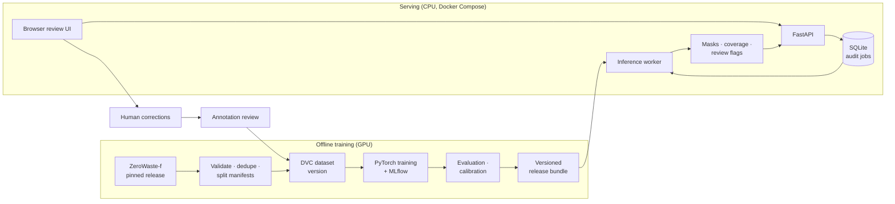

<div align="center">

# BeltWatch

**Visual contamination auditing for paper-recycling conveyor lines**

Semantic segmentation · visible-coverage estimation · uncertainty-aware review queue · auditable human feedback

[](https://github.com/professor3333/beltwatch/actions/workflows/ci.yml)
[](LICENSE)
[](https://ai.bu.edu/zerowaste/)


</div>

> [!NOTE]
> **Project status: design phase.** The design is complete
> ([`docs/design.md`](docs/design.md)), and implementation is starting with the
> MVP. No models have been trained yet. This README lists **no results** and
> no features as done until they exist and are measured.

## Architecture



## The problem

Paper-recycling streams contain materials that operators want removed:
**cardboard, soft plastic film, rigid plastic, and metal**. These are hard to
spot. Waste arrives crushed, folded, dirty, overlapping, and sometimes
translucent. A plastic bag can be almost invisible against paper, and printed
cardboard can look like the surrounding stream.

BeltWatch helps a quality technician decide **which inspection images deserve
attention** and shows the suspected material clearly. For each image it
answers:

- **What** material might be present?
- **Where** is it visible?
- **How much** of the inspected region does it occupy?
- **Does it need review?** This combines coverage, model uncertainty, and
  image quality.
- **What did the reviewer decide?** Each image keeps an append-only,
  versioned audit record.

### What BeltWatch measures, and what it does not

BeltWatch reports **estimated visible coverage**: the fraction of valid pixels
inside an operator-defined inspection region that the model assigns to each
material.

$$
\text{coverage}_c = \frac{\text{pixels predicted as material } c \text{ inside the region}}{\text{valid pixels inside the region}}
$$

It does **not** estimate contamination by weight, certify bale purity, or
prove that an image is clean. "Background" means "outside the four target
labels", not "verified clean paper".

## Planned workflow

1. Upload a batch of conveyor snapshots and draw the inspection region.
2. An asynchronous job validates the images and runs segmentation on CPU.
3. Per-material visible coverage and uncertainty are computed for each image.
4. A review queue ranks images. It prioritizes high coverage, reserves a share
   for uncertain cases, and adds a random sample of low-risk images to catch
   missed material.
5. The reviewer inspects overlays and confirms or corrects each finding.
6. BeltWatch exports an audit report with the model version and provenance.
7. Reviewed corrections become candidates for the next dataset version.

## Approach

| Role | Model |
|---|---|
| Sanity check | All-background prediction |
| Classical baseline | Random forest on color, gradient, and multiscale texture features |
| Deep-learning baseline | U-Net with an ImageNet-pretrained ResNet-18 encoder |
| Challenger | SegFormer-B0 with a five-class head |

The **primary metric is foreground macro IoU** over the four material
classes, so abundant background pixels can't inflate the score. Supporting
metrics:

- per-class IoU, precision, and recall
- visible-coverage MAE in percentage points
- recall versus review workload
- calibration error
- CPU latency and memory

Confidence intervals use a paired bootstrap over recording groups. A neural
model must clearly beat the *tuned* classical baseline to be adopted, and a
well-tuned U-Net is an acceptable winner.

Details: [design §9–§16](docs/design.md#9-model-strategy).

## Tech stack

| Area | Tools |
|---|---|
| Modeling | PyTorch, Hugging Face Transformers, scikit-learn, scikit-image |
| Data and experiments | DVC, MLflow, Pillow/OpenCV, NumPy |
| Serving | FastAPI, Pydantic, SQLite, a small HTML/JS frontend |
| Operations | Docker Compose, Prometheus, GitHub Actions |
| Optional optimization | ONNX Runtime, adopted only if benchmarks justify it |

## Roadmap

**MVP**
- [ ] Reproducible ZeroWaste-f download, checksum verification, and validation
- [ ] Duplicate and leakage audit; versioned split manifests
- [ ] Classical random-forest baseline
- [ ] One trained neural segmentation model
- [ ] Upload, inspection-region selection, overlay, and visible coverage
- [ ] Basic human review
- [ ] Dockerized API and interface
- [ ] Held-out evaluation

**Version 1**
- [ ] U-Net vs. SegFormer comparison, focused ablations, 3-seed finalists
- [ ] Temperature-scaling calibration and uncertainty-aware review
- [ ] Durable jobs with leases, retries, and recovery
- [ ] Feedback history and report export
- [ ] Versioned release bundles and tested rollback
- [ ] Automated error-analysis report
- [ ] CI, CPU benchmarks, and monitoring
- [ ] A usability study of review time and detection recall

The full plan, targets, and Definition of Done are in
[`docs/design.md`](docs/design.md).

## Data

BeltWatch uses **ZeroWaste-f** from Boston University and collaborators:
RGB frames from an operating paper-recycling conveyor with polygon labels for
cardboard, soft plastic, rigid plastic, and metal.

- Project: <https://ai.bu.edu/zerowaste/>
- Release: [Zenodo record 6412647](https://zenodo.org/records/6412647) (`zerowaste-f-final.zip`, about 7.5 GB)
- Paper: Bashkirova et al., [PMLR vol. 220](https://proceedings.mlr.press/v220/bashkirova23a/bashkirova23a.pdf)

> [!IMPORTANT]
> **License discrepancy.** The Zenodo record shows CC BY 4.0, while the
> project website and [repository](https://github.com/dbash/zerowaste) state
> CC BY-NC 4.0. BeltWatch treats the dataset as **attributed and
> noncommercial**. The dataset is downloaded by the user and is never
> redistributed in this repository. See
> [THIRD_PARTY_NOTICES.md](THIRD_PARTY_NOTICES.md).

## Known limitations (by design)

- The frames come from related video footage, and the dataset's official
  train/val/test splits share recording sequences
  ([details](docs/dataset_card.md#splits-and-leakage-findings)), so results on
  the official test split may be optimistic. BeltWatch keeps the official
  test set but repairs leakage: it removes training frames near evaluation
  frames and training duplicates of evaluation images, and reports an
  unseen-recording slice separately
  ([split policy](docs/dataset_card.md#split-policy-official-repaired)).
- The data covers one facility and a narrow range of operating conditions.
  BeltWatch makes no claim about other facilities or cameras without local
  validation.
- It recognizes only four target materials, and rare classes have few
  examples.
- Visible coverage is not contamination by weight.

## Development

Requires Python 3.12 and [uv](https://docs.astral.sh/uv/).

```bash
uv sync                       # create .venv and install locked dependencies
uv run pytest -m "not slow"   # tests (no network or dataset needed)
uv run ruff check             # lint
uv run ruff format --check    # formatting
uv run mypy                   # strict type checking of src/
```

### Getting the data

The data pipeline is defined in [`dvc.yaml`](dvc.yaml) and run with
[DVC](https://dvc.org/):

```bash
uv run dvc repro            # download → validate → duplicates → splits
```

The `download` stage (also runnable directly with
`uv run python -m beltwatch.data.download`) downloads the pinned ZeroWaste-f release (about 7.5 GB, resumable),
verifies its size and MD5 against [`configs/data.yaml`](configs/data.yaml),
extracts it to `data/raw/zerowaste-f/`, and writes the measured image counts
to `data/manifests/zerowaste-f-download.json`. Reserve about 20 GB of free
disk for the archive plus the extracted files. Use `--skip-extract` to
download and verify only.

## Repository layout

```
configs/data.yaml        Pinned dataset release (record, version, size, MD5) and data paths
dvc.yaml                 Data pipeline stages
src/beltwatch/labels.py  Single source of truth for class IDs, names, and the ignore index
src/beltwatch/data/      Data configuration, verified downloader, validation, duplicate audit, splits
data/manifests/, data/splits/  Git-tracked pipeline outputs (written by the first full run)
tests/                   Unit and data tests (no network needed)
docs/design.md           Full design: problem, data, models, evaluation, system, Definition of Done
docs/dataset_card.md     Dataset provenance, licensing, and known limitations
THIRD_PARTY_NOTICES.md   Dataset and model licensing
```

The source tree (`src/beltwatch/`, `api/`, `frontend/`, `configs/`,
`tests/`) will be added as implementation proceeds. See
[design §29](docs/design.md#29-repository-structure).

## License

The code is released under the [MIT License](LICENSE). The ZeroWaste-f
dataset and the pretrained SegFormer weights have their own, more restrictive
terms. See [THIRD_PARTY_NOTICES.md](THIRD_PARTY_NOTICES.md).

## Acknowledgements

This project builds on the ZeroWaste dataset by Dina Bashkirova et al. and on
SegFormer by NVIDIA Research.
