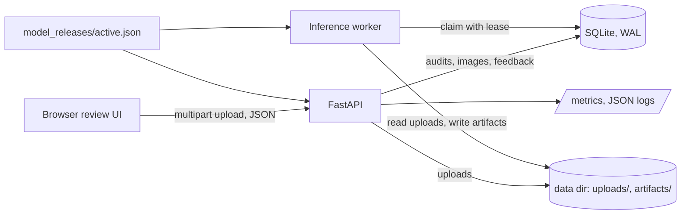

# Architecture

One API process and one inference worker share a SQLite database (WAL mode)
and a data directory. Training runs elsewhere; only a release bundle is
deployed.

## Request lifecycle

1. `POST /v1/audits` validates the options (normalized inspection polygon),
   the file count, and every file's **decoded** content: format (PNG, JPEG,
   or WebP), pixel limit, minimum size, and region coverage. It refuses with
   an explicit error code when no worker is alive, no model release is
   usable, or the queue is full. It stores the uploads, creates the audit
   pinned to the active release, preprocessing version, and review-policy
   version, and returns `queued`.
2. The worker claims the oldest claimable audit in a `BEGIN IMMEDIATE`
   transaction, setting a lease and incrementing its attempt counter.
3. For each pending image the worker runs the pipeline (input quality →
   prediction → coverage in the region → uncertainty → review decision),
   writes the mask, overlay, and uncertainty images atomically, and records
   the result. Progress is saved after every image.
4. When no image is pending, the audit becomes `complete`, `partial` (some
   images failed), or `failed`.
5. Reviewers fetch results and overlays, submit feedback (append-only), and
   export a JSON or CSV report with provenance.

## Failure handling

| Situation | Behaviour |
|---|---|
| Worker dies mid-audit | The lease expires and another worker reclaims the audit (attempt + 1) |
| Transient error (e.g. out of memory) | The lease is released at once for a prompt retry |
| Attempts exhausted | Pending images fail and the audit records `max_attempts_exceeded` |
| Stale worker finishes late | Its write is rejected: results need the current lease and a `pending` image |
| Invalid or corrupt image | That image fails with `invalid_image: ...`; the rest continue |
| Pinned release missing | The audit fails with `model_release_unavailable`; no other model is used |
| Identical request | Served from the result cache (image hash + region + preprocessing, model, and policy versions); artifacts are copied, not shared |
| Same idempotency key, same request | The existing audit is returned (HTTP 200) |
| Same idempotency key, different request | HTTP 409 `idempotency_conflict` |

Per-image processing is bounded by input limits (file size, pixel count). A
per-audit deadline fails images that are still pending when it passes.

## Data model

| Table | Holds |
|---|---|
| `audits` | Status, camera, inspection region, pinned model, preprocessing and policy versions, idempotency key, lease, attempts, retention deadline, training consent |
| `images` | Original filename, SHA-256, size, upload path, status, error, cache key, result JSON |
| `artifacts` | Original, overlay, mask, uncertainty, and correction files (paths relative to the data directory) |
| `feedback` | Reviewer decisions, materials present, optional corrected mask, model version. **Append-only**: a trigger rejects updates |
| `workers` | Heartbeats, used for readiness and the "no worker available" check |

Images and masks are files, never database blobs. Uploads expire after the
retention period (24 hours by default) and are deleted by the worker.
Feedback is used for training only when the audit was created with
`training_consent: true`, and only after annotation review.

## Model releases

See [`model_releases/README.md`](../model_releases/README.md). A release
bundles the model file (SHA-256 verified on load), the preprocessing version,
the label map, the temperature, and the full review policy. Audits pin a
release version, and rollback is a pointer change that restores all of them
together.

## Review routing

Defined in [`configs/review_policy.yaml`](../configs/review_policy.yaml)
(versioned):

- `retake_image`: unusable input (blurred, under- or overexposed, clipped).
- `manual_review`: the uncertain share of the region is at or above the
  threshold.
- `review`: target coverage is at or above the threshold, or the image was
  picked for a deterministic random audit of low-risk images.
- `none`: no review is needed. This does **not** certify the belt is clean.

Priority is target coverage plus a weighted uncertain fraction. The status
endpoint returns the review queue in priority order.

## Configuration

Environment variables, all prefixed `BELTWATCH_`: `DATA_DIR`, `RELEASES_DIR`,
`MAX_FILES_PER_AUDIT`, `MAX_FILE_BYTES`, `MAX_IMAGE_PIXELS`,
`MAX_PENDING_AUDITS`, `LEASE_SECONDS`, `MAX_ATTEMPTS`, `JOB_DEADLINE_SECONDS`,
`RETENTION_HOURS`, `WORKER_STALE_SECONDS`, `REQUIRE_WORKER`, `METRICS_TOKEN`
(protects `/metrics`), `DEVICE`, and `TORCH_THREADS`.
