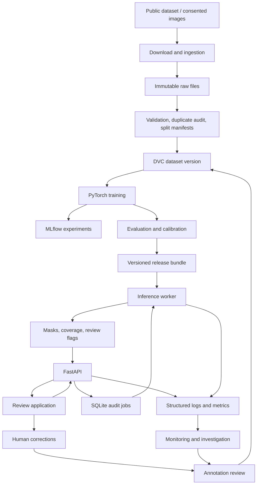

# BeltWatch — Design Document

> **Visual Contamination Auditing for Recycling Lines**
>
> An end-to-end deep-learning application that segments unwanted materials in
> paper-recycling conveyor imagery and turns predictions, uncertainty, and
> operator feedback into a prioritized quality-audit workflow.

All performance targets and compute estimates in this document are **proposed
planning values, not results already achieved.**

## Contents

1. [Overview](#1-overview)
2. [Real-world problem](#2-real-world-problem)
3. [Users](#3-users)
4. [Why deep learning is appropriate](#4-why-deep-learning-is-appropriate)
5. [Dataset and data collection](#5-dataset-and-data-collection)
6. [What the finished system does](#6-what-the-finished-system-does)
7. [Inputs → prediction → action](#7-inputs--prediction--action)
8. [Deep-learning problem type](#8-deep-learning-problem-type)
9. [Model strategy](#9-model-strategy)
10. [Pretraining versus training from scratch](#10-pretraining-versus-training-from-scratch)
11. [Data pipeline](#11-data-pipeline)
12. [Training pipeline](#12-training-pipeline)
13. [Compute requirements](#13-compute-requirements)
14. [Evaluation strategy](#14-evaluation-strategy)
15. [Error analysis](#15-error-analysis)
16. [Uncertainty and confidence](#16-uncertainty-and-confidence)
17. [System architecture](#17-system-architecture)
18. [Inference system](#18-inference-system)
19. [API design](#19-api-design)
20. [Database and storage](#20-database-and-storage)
21. [Deployment](#21-deployment)
22. [Inference optimization](#22-inference-optimization)
23. [Monitoring and observability](#23-monitoring-and-observability)
24. [Real-world challenges](#24-real-world-challenges)
25. [Testing strategy](#25-testing-strategy)
26. [MLOps and maintainability](#26-mlops-and-maintainability)
27. [Success metrics](#27-success-metrics)
28. [Demo experience](#28-demo-experience)
29. [Repository structure](#29-repository-structure)
30. [Scope control and Definition of Done](#30-scope-control-and-definition-of-done)

---

## 1. Overview

BeltWatch helps recycling-facility operators audit contamination on
paper-sorting conveyor belts. It segments unwanted materials in inspection
images, estimates their visible coverage, prioritizes images for human review,
and records corrections that improve later model versions.

The scope is deliberately bounded: one conveyor-stream type, four material
categories, a small segmentation model, and a deployed review application.

## 2. Real-world problem

A paper-recycling conveyor can contain materials that operators want removed:
plastic film, rigid plastic, metal, and certain cardboard products.

The visual problem is difficult because waste arrives crushed, folded, dirty,
overlapping, and sometimes translucent. A plastic bag can be almost invisible
against paper; printed cardboard can resemble the surrounding paper stream.
These conditions are represented in the real industrial imagery collected for
[ZeroWaste](https://ai.bu.edu/zerowaste/).

BeltWatch addresses one specific problem: **deciding which inspection images
deserve an operator's attention and showing the suspected material clearly.**

The workflow supports quality audits between manual inspections. An operator
examines a ranked set of images, confirms what is present, and decides whether
to inspect an upstream sorting stage or take a physical sample.

Facilities currently combine sorting machinery, manual sorting, and inspection.
The research behind ZeroWaste documents continued reliance on manual work and
substantial variation between facilities
([Bashkirova et al., 2023](https://proceedings.mlr.press/v220/bashkirova23a/bashkirova23a.pdf)).

The deliverable is an **auditable inspection record**: image, suspected
material, visible location, model version, and human decision.

Its measurement is **visible image coverage**. It does not estimate contaminant
mass, certify bale purity, or identify every possible unwanted substance.

## 3. Users

| User | How they would use BeltWatch |
|---|---|
| Recycling-facility quality technician | Upload inspection snapshots, review likely contamination, and export an audit report. |
| Conveyor-line supervisor | Examine recurring material categories and decide where to investigate the sorting process. |
| Recycling-process engineer | Compare reviewed samples from the same camera setup before and after an operational change. |
| Computer-vision engineer supporting a facility | Inspect failures, curate corrections, and evaluate replacement models. |

Workflow:

```
Collect snapshots → review prioritized images → confirm findings → inspect the relevant process → retain the audit record
```

A browser application using public images is sufficient to demonstrate this
workflow. Claims about actual facility savings require a facility pilot.

## 4. Why deep learning is appropriate

The required capability is recognizing material categories and tracing their
visible boundaries under severe appearance variation.

| Approach | What it can do | Why it is insufficient by itself |
|---|---|---|
| Color thresholds | Separate distinctive colors under stable lighting | Paper, cardboard, and plastics have overlapping colors. |
| Background subtraction | Find objects against an empty belt | The target scene contains a dense stream of overlapping material. |
| Edges and connected components | Find local boundaries | Printed graphics, folds, shadows, and occlusion produce misleading boundaries. |
| Handcrafted texture features + random forest | Provide a credible classical segmentation baseline | Fixed descriptors struggle to combine material appearance, shape, and wider spatial context. |
| Learned semantic segmentation | Combine local texture, object structure, and surrounding context across scales | Requires representative labels and careful evaluation. |

Deep networks can learn representations that distinguish, for example,
crumpled reflective plastic from printed paper using more than a single color
or texture statistic.

There is no guarantee that a particular architecture will win before
experimentation. **Meaningful improvement over a tuned classical baseline is an
acceptance criterion**: the project must demonstrate the value of learned
representations empirically.

## 5. Dataset and data collection

### Required dataset: ZeroWaste-f

| Property | Details |
|---|---|
| Source | Boston University and collaborators; original ZeroWaste project |
| Size | Project website lists 4,503 annotated images (actual extracted count to be recorded) |
| Download | Zenodo release `zerowaste-f-final.zip`, approximately 7.5 GB |
| Modality | RGB frames from an operating recycling conveyor |
| Labels | Polygon segmentation for cardboard, soft plastic, rigid plastic, and metal |
| Background | Includes paper, the conveyor, and other objects outside those four labels |
| Access | Current release is marked open and exposes download links |
| Relevant difficulty | Clutter, deformation, translucency, occlusion, and class imbalance |

Sources: [project website](https://ai.bu.edu/zerowaste/) ·
[Zenodo record 6412647](https://zenodo.org/records/6412647) ·
[paper](https://proceedings.mlr.press/v220/bashkirova23a/bashkirova23a.pdf) ·
[GitHub](https://github.com/dbash/zerowaste)

**Licensing discrepancy:** the Zenodo page displays CC BY 4.0, while the project
website and repository state CC BY-NC 4.0. This is recorded in the dataset
card. BeltWatch is an attributed, noncommercial demonstration; the applicable
terms should be clarified with the authors before any commercial reuse.

The downloader pins the release, validates the published checksum, and records
the actual extracted image count.

**Known limitations**

- Many frames come from related video footage, so independence cannot be assumed.
- The original collection represents a narrow range of operating conditions.
- Rare materials provide fewer training examples.
- Overlapping or translucent material creates ambiguous boundaries.
- Background is not a reliable "clean paper" label.
- Released labeled frames do not provide continuous-video event annotations.

### Supplementary staged robustness dataset

A small staged dataset using clean packaging on a paper-covered surface:

- Roughly 250 images across 8–12 recording sessions.
- Varied lighting, camera height, overlap, blur, and packaging condition.
- Separate physical items and sessions for development and final testing.
- The same four material categories, annotated in CVAT.
- Approximately 20–40 annotation hours; 1–3 GB for originals, masks, and metadata.

This dataset tests behavior on a new camera and setup. It does not establish
performance at another recycling facility.

Any future facility capture requires the operator's permission, framing only
the conveyor, no recording of workers, and storage and retention rules agreed
before capture.

## 6. What the finished system does

1. A user uploads a batch of conveyor snapshots.
2. They select or draw the conveyor region to inspect.
3. BeltWatch validates the images and creates an audit job.
4. A segmentation model predicts the four material categories.
5. The system calculates visible coverage inside the selected region.
6. It identifies poor-quality or uncertain results.
7. A review queue prioritizes suspected contamination and uncertain cases.
8. The user inspects overlays and confirms or corrects findings.
9. BeltWatch exports an audit report with evidence and provenance.
10. Reviewed corrections become candidates for the next dataset version.

Each result answers:

- What material might be present?
- Where is it visible?
- How much of the inspected image region does it occupy?
- Does this result need review?
- What did the reviewer decide?

## 7. Inputs → prediction → action

| Stage | Definition |
|---|---|
| Inputs | RGB images, optional capture timestamps, camera identifier, and a polygon defining the inspection region |
| Model output | Five-class pixel logits: four target materials plus background |
| Derived output | Segmentation mask, per-material visible coverage, uncertainty indicators, quality flags, and review priority |
| User action | Confirm the suspected material, correct a mask, request another image, or investigate the relevant sorting stage |

Material coverage:

$$
\text{coverage}_c = \frac{\text{pixels predicted as material } c \text{ inside the inspection region}}{\text{valid pixels inside the inspection region}}
$$

This is labelled **"estimated visible coverage."** It is never presented as
percentage contamination by weight.

## 8. Deep-learning problem type

Multiclass **semantic segmentation**. Every valid pixel receives one of five
labels:

| ID | Class |
|---|---|
| 0 | Background |
| 1 | Cardboard |
| 2 | Soft plastic |
| 3 | Rigid plastic |
| 4 | Metal |

Semantic segmentation fits the product because the operator needs material
location and approximate visible coverage. Instance segmentation would add
object identities and counts, which the initial audit workflow does not
require. Uncertainty estimation and review prioritization are system
components built around the segmentation model.

## 9. Model strategy

### Simple baselines

- **All-background prediction:** a sanity check exposing how misleading overall
  pixel accuracy can be.
- **Random-forest segmentation:** trained on sampled pixels using color,
  gradients, local texture, and multiscale filter responses. Pixels are sampled
  across images and classes; the forest is tuned on development data and
  evaluated on full images with the same masks and metrics as the neural models.

### Deep-learning baseline

**U-Net with an ImageNet-pretrained ResNet-18 encoder** — an understandable
encoder–decoder with skip connections for boundary recovery, modest training
requirements, and a strong baseline for a small dataset. With small batches,
pretrained batch-normalization statistics are frozen or a suitable decoder
normalization is used.

### Strong model

**[SegFormer-B0](https://github.com/NVlabs/SegFormer)** as the main challenger.
Its hierarchical transformer encoder combines information across scales, and
its lightweight decoder makes it a reasonable candidate for CPU serving. The
pretrained classifier is replaced with a five-class head.

Models are compared under matched data and preprocessing. The deployed model is
selected on segmentation quality, minority-class performance, memory, and
measured latency. **A well-tuned U-Net remains a valid winner.**

The original SegFormer release carries noncommercial research/evaluation
restrictions, recorded alongside checkpoint provenance
([license](https://github.com/NVlabs/SegFormer#license)).

## 10. Pretraining versus training from scratch

Transfer learning schedule:

1. Initialize the encoder from pretrained weights.
2. Train the new decoder/head with the encoder frozen for a short warm-up.
3. Unfreeze the encoder.
4. Fine-tune with a smaller encoder learning rate.
5. Select the checkpoint using validation performance.

One smaller training-from-scratch experiment quantifies the value of
pretraining, if the compute budget allows.

Full fine-tuning is reasonable for these compact models; LoRA would add
complexity without solving a memory problem. Self-supervised pretraining
becomes worthwhile only with substantially more relevant unlabeled data.

## 11. Data pipeline

```
Download → verify → validate → audit duplicates → assign splits → transform → version → train
```

Splitting happens **before** generating augmented derivatives.

**Ingestion**
- Pin the source release and filenames; verify published checksums.
- Preserve immutable originals.
- Produce a manifest with image ID, source, dimensions, annotation path, hash,
  and available capture metadata.

**Validation**
- Decode every image; check image–annotation pairing.
- Validate polygon geometry and category identifiers.
- Check for empty, invalid, or out-of-bounds annotations.
- Quarantine corrupt files with explicit reasons.

**Preprocessing**
- Convert consistently to RGB; preserve aspect ratio.
- Working long side of 768 pixels, padded to the model's required dimensions.
- Train on 512 × 512 crops; evaluate on complete resized frames.
- Bilinear interpolation for images/logits; nearest-neighbor for class masks.
- Mark padding and genuinely undefined regions with an ignore index.
- Preserve background as a valid class; never accidentally remove label zero.
- Use the official mask-conversion behavior where possible and document how
  overlapping polygons are handled.

**Leakage prevention**
- Start from the released splits.
- Audit exact duplicates (hashes) and near-duplicates (perceptual similarity).
- Keep frames from the same source sequence together wherever identifiers exist.
- Keep all crops and augmentations with their source image.
- Exclude training examples that overlap protected evaluation groups.
- If sequence identifiers cannot be recovered, describe the remaining leakage
  risk. Similarity clustering cannot prove independence.

**Augmentation and imbalance**
- Moderate brightness/contrast changes, blur, compression, scale changes, and
  horizontal flips, with identical geometric transforms on image and mask.
- Compare modest class weighting or material-aware crop sampling against
  ordinary sampling, preserving ordinary and background-heavy scenes.

Tools: Python, Pillow/OpenCV, NumPy, scikit-image, PyTorch transforms, DVC.

## 12. Training pipeline

Plain PyTorch, validated YAML configuration, and MLflow.

| Concern | Implementation |
|---|---|
| Configuration | Model, dataset version, split IDs, loss, resolution, seed, optimizer, and schedule in YAML |
| Reproducibility | Seed Python/NumPy/PyTorch; record package versions, hardware, and deterministic settings |
| Batching | 2–4 crops per GPU batch |
| Effective batch size | Gradient accumulation to approximately 8–16 where useful |
| Optimizer | AdamW |
| Learning rates | Starting point: encoder 3e-5, new head 3e-4 |
| Schedule | Short warm-up followed by cosine decay |
| Loss | Cross-entropy baseline; compare cross-entropy + foreground Dice |
| Regularization | Weight decay, augmentation, early stopping |
| Precision | Mixed precision on supported GPUs |
| Checkpointing | Best validation checkpoint and resumable latest checkpoint |
| Tracking | MLflow metrics, configurations, artifacts, examples, and run comparisons |
| Versioning | Dataset hash, code commit, configuration hash, and checkpoint digest |

A deliberately small experiment matrix:

- U-Net versus SegFormer.
- Cross-entropy versus cross-entropy + Dice.
- Standard versus material-aware sampling.
- Lower versus higher inference resolution.

Short runs eliminate poor configurations; finalists are repeated across three
seeds. No large hyperparameter search.

A model release includes weights, preprocessing, label mapping, calibration
parameters, threshold configuration, evaluation report, and provenance.

## 13. Compute requirements

Engineering estimates, to be validated with an initial timed run.

| Resource | Practical starting point |
|---|---|
| Development CPU | 4–8 cores |
| Development RAM | 16 GB comfortable; 8 GB workable with careful loading |
| Training GPU | 8 GB VRAM workable; 12–16 GB more comfortable |
| Training resolution | 512 × 512 crops |
| Main dataset download | Approximately 7.5 GB |
| Working storage | 30–50 GB for extracted data, caches, checkpoints, and reports |
| Serving hardware | CPU-only; benchmarking starts on 4 vCPU / 8 GB RAM |

Approximately 2–8 GPU-hours per substantial training run, with a 20–50
GPU-hour development allowance. The first 500–1,000 training steps are timed
before the remaining budget is calculated.

Where it can run: a local machine (development, classical baseline,
preprocessing, testing, CPU inference); a local NVIDIA GPU; Colab or Kaggle
with resumable checkpoints (availability not guaranteed); or a rented GPU for
short, bounded jobs. Serving does not require a GPU.

## 14. Evaluation strategy

### Primary metric

**Foreground macro IoU**, averaged across the four target material classes:

$$
IoU_c = \frac{TP_c}{TP_c + FP_c + FN_c}
$$

Confusion counts are aggregated across the evaluation set, then the four class
IoUs are averaged. This prevents abundant background pixels from dominating the
headline result.

### Supporting metrics

| Metric | Purpose |
|---|---|
| Per-class IoU and Dice | Expose weak material categories |
| Per-class precision and recall | Separate false alarms from missed material |
| Five-class mIoU | Conventional segmentation reference |
| Visible-coverage MAE | Error in the quantity shown to users (percentage points of region area) |
| Recall versus review workload | How effectively the queue finds relevant images |
| Calibration error and reliability plots | Confidence quality |
| p50/p95 latency, throughput, memory | Deployment feasibility |

### Evaluation splits

- **Training:** released training data after leakage checks.
- **Validation:** model and hyperparameter selection.
- **Calibration:** a separate grouped holdout reserved from development data.
- **Test:** locked evaluation data, untouched by tuning.
- **Robustness:** staged images or later consented facility images, reported separately.

After final test evaluation, further tuning requires a new untouched evaluation
set for a fresh unbiased claim.

### Review-workload evaluation

An **audit-positive** image is defined by a predeclared rule: more than 5%
ground-truth visible coverage of the four target materials inside the
inspection region. This is a project evaluation convention, not an industrial
acceptance standard.

The fraction of audit-positive images retrieved is plotted against the fraction
of images reviewed, comparing random ordering, classical-baseline ordering,
neural ordering, and neural ordering with uncertainty and random-audit
allocations. Every reviewed image counts toward workload, and prevalence is
reported.

### Statistical and robustness checks

- Paired bootstrap confidence intervals over independent recording groups where available.
- Individual pixels are never treated as independent samples.
- Uncertainty about independence is reported when only approximate groups exist.
- Slices by material, object size, clutter, blur, lighting, and coverage.
- Controlled brightness, blur, and compression perturbations.
- Model-selection and final-test results are kept clearly separate.

## 15. Error analysis

An automatically generated report containing: pixel confusion matrix;
per-class false-positive and false-negative galleries; largest coverage errors;
high-confidence mistakes; uncertain but correct predictions; failure rates by
slice; and out-of-domain examples.

| Failure | Likely next investigation |
|---|---|
| Transparent plastic disappears | Resolution, relevant examples, boundary ambiguity |
| Printed paper becomes cardboard | Label consistency and learned texture shortcuts |
| Small metal pieces are missed | Class frequency, crop scale, and resolution |
| Large coverage overestimates | Merged regions, shadows, or preprocessing errors |
| New-camera images fail | Domain shift and camera normalization |
| All models fail at the same boundary | Annotation ambiguity |

Embeddings with PCA/UMAP are exploratory tools; conclusions are verified
against the actual images. The next experiment is chosen from the most
consequential recurring failure — not from architecture curiosity.

## 16. Uncertainty and confidence

Three separate questions:

1. Is the input usable?
2. How uncertain is the model about its labels?
3. Does the image resemble the data on which the model was evaluated?

- **Input quality:** flag severe blur, underexposure, missing inspection
  regions, and decoding failures.
- **Calibration:** temperature scaling fitted on the calibration split,
  evaluated overall and for foreground classes.

**Review policy**

- Prioritize large suspected target-material coverage.
- Reserve part of the queue for uncertain predictions.
- Include a random sample of apparently low-risk images.
- Route unusable images to "retake image."
- Route uncertain images to "manual review."

Uncertain regions are shown with a distinct overlay. No single number
suggesting an image is "97% correct" is displayed.

Entropy and embedding distance are useful review signals but cannot reliably
detect every unfamiliar input. **A confident background prediction does not
certify cleanliness.** Segmentation is evaluated on all eligible test images,
including those the application would send to review.

## 17. System architecture



| Component | Choice and purpose |
|---|---|
| Model development | PyTorch; Hugging Face Transformers for SegFormer |
| Classical baseline | scikit-learn and scikit-image |
| Dataset versioning | DVC plus explicit manifests |
| Experiment tracking | Local MLflow |
| Model registry | Immutable release directories and a versioned deployment manifest |
| Inference | PyTorch initially; ONNX Runtime if benchmarking supports it |
| API | FastAPI and Pydantic |
| Frontend | Small HTML/JavaScript interface served by FastAPI |
| Application database | SQLite |
| File storage | Local persistent directories, with an object-store interface if later needed |
| Monitoring | JSON logs, Prometheus metrics, optional Grafana dashboard |
| Packaging | Docker Compose |
| CI/CD | GitHub Actions |

One API process and one inference worker; a SQLite job table is adequate at
this scale. If concurrent usage grows, the database, work queue, and worker
count are revisited while the model interface stays unchanged.

## 18. Inference system

Asynchronous batch inference, including for a single image. The application
returns a job ID and displays progress.

**Worker behavior**

1. Claim a queued job transactionally.
2. Resolve the model release pinned when the job was created.
3. Decode and validate each image.
4. Apply the shared preprocessing code.
5. Run inference with gradients disabled.
6. Restore predictions to the original image coordinates.
7. Calculate coverage within the selected region.
8. Apply quality and review rules.
9. Write artifacts and mark the job complete.

**Operational details**

- Load the model once at worker startup; batch size one on CPU initially.
- Limit pending jobs and upload sizes; per-image and per-job deadlines.
- Store progress after each image.
- Recover interrupted jobs using job leases and attempt counters.
- Retry transient failures a bounded number of times.
- Return explicit failure reasons for invalid images.
- Cache by image hash + inspection region + preprocessing version + model
  version + review-policy version.
- On model failure, preserve the job and report the failure. Never substitute
  an unannounced model with different behavior.

## 19. API design

| Endpoint | Purpose |
|---|---|
| `POST /v1/audits` | Upload images and create an audit job |
| `GET /v1/audits/{audit_id}` | Status, progress, and result summaries |
| `GET /v1/audits/{audit_id}/images/{image_id}` | Detailed prediction metadata |
| `GET /v1/audits/{audit_id}/artifacts/{artifact_id}` | Download overlays or masks |
| `POST /v1/audits/{audit_id}/feedback` | Submit reviewed findings or mask corrections |
| `GET /v1/audits/{audit_id}/report` | Export CSV or JSON |
| `DELETE /v1/audits/{audit_id}` | Delete an uploaded audit and its artifacts |
| `GET /v1/model` | Active model provenance and limitations |
| `GET /health/live` | API process is alive |
| `GET /health/ready` | Required components are available |
| `GET /metrics` | Restricted operational metrics |

`POST /v1/audits` accepts multipart image files and an options object.
Coordinates are normalized to image width and height:

```json
{
  "camera_id": "paper-line-demo",
  "inspection_region": [[0.05, 0.10], [0.95, 0.10], [0.95, 0.90], [0.05, 0.90]],
  "profile": "paper-stream-v1"
}
```

Creation response:

```json
{
  "audit_id": "audit_01",
  "status": "queued",
  "model_version": "beltwatch-1.0.0",
  "status_url": "/v1/audits/audit_01"
}
```

Illustrative completed-image result (example numbers illustrate the contract
only):

```json
{
  "image_id": "frame_003",
  "status": "complete",
  "model_version": "beltwatch-1.0.0",
  "visible_coverage": {
    "cardboard": 0.049,
    "soft_plastic": 0.025,
    "rigid_plastic": 0.006,
    "metal": 0.002
  },
  "total_target_coverage": 0.082,
  "uncertain_pixel_fraction": 0.11,
  "review_required": true,
  "review_reasons": ["target_coverage", "uncertain_regions"],
  "overlay_url": "/v1/audits/audit_01/artifacts/overlay_003"
}
```

Job creation supports idempotency keys. Invalid schemas, oversized uploads,
queue saturation, and unavailable workers receive explicit responses.

## 20. Database and storage

A database is justified because jobs, predictions, and corrections must remain
connected across requests and restarts.

**SQLite stores:** audit jobs and status; image metadata and hashes; camera and
inspection-region configuration; model version per prediction; coverage
summaries and review flags; reviewer decisions and correction history; artifact
locations and retention deadlines.

**Files store:** original uploads; segmentation masks; overlay images; exported
reports; model release bundles.

**Training storage remains separate:** DVC-managed datasets and manifests;
MLflow experiment database; checkpoints and evaluation artifacts.

Images and masks are stored as files, not database blobs. Corrections are
append-only so the original prediction and later human decision remain
distinguishable. An anonymous public demo expires uploads after a short
documented period (24 hours); training feedback is persisted only with the
user's agreement.

## 21. Deployment

The primary deployment is one CPU Linux machine running Docker Compose:

- Reverse proxy with HTTPS.
- FastAPI application and frontend.
- One inference worker.
- Persistent volume for SQLite and artifacts.
- Optional monitoring containers.

Training runs separately. Only the selected model bundle, the application, and
a small demonstration sample are deployed. The same Compose setup runs on a
laptop for a reproducible demonstration without hosting fees. A hosted
demonstration uses a modest CPU VM with a fixed spending limit.
[Hugging Face Spaces](https://huggingface.co/docs/hub/spaces-overview) is an
option, but Docker Spaces may have plan requirements and default disk storage
is [ephemeral](https://huggingface.co/docs/hub/spaces-storage).

**Release procedure**

1. Build an immutable container.
2. Verify the model artifact checksum.
3. Start the new release.
4. Run readiness and sample-inference checks.
5. Switch traffic.
6. Retain the previous image and model bundle for rollback.

The application database and persistent artifacts are backed up. A
single-machine deployment has downtime risk; that tradeoff is documented.

## 22. Inference optimization

Optimization is driven by measurement.

**First priorities:** keep the model loaded; avoid repeated preprocessing and
unnecessary copies; set sensible CPU thread counts; limit working resolution;
cache repeat requests; profile decoding, model execution, and artifact
generation separately.

**Next experiment: ONNX Runtime.** Export the selected model and compare
end-to-end latency, peak memory, per-class IoU, visible-coverage error, and
numerical differences from PyTorch. The export is retained only if it provides
a worthwhile improvement.

**Quantization** is optional — INT8 only if CPU latency remains a problem, with
representative development images for calibration, followed by re-evaluation
of accuracy and probability calibration
([ONNX Runtime quantization](https://onnxruntime.ai/docs/performance/model-optimizations/quantization.html)).

Proposed acceptance gate:

- At least 20% measured latency improvement.
- No more than 1 percentage point loss in foreground macro IoU.
- No unacceptable regression on a rare material.

GPU FP16, TensorRT, pruning, and distillation wait until a measured deployment
constraint justifies them.

## 23. Monitoring and observability

**System monitoring:** request volume; queue length and oldest-job age; image
processing latency; job completion latency; throughput; worker memory and CPU;
decode failures, inference failures, and timeouts; worker restarts and disk
usage. Structured logs carry request IDs, job IDs, and model versions.

**ML monitoring** (by camera and model version): predicted coverage
distributions; uncertainty distribution; fraction routed to review; blur and
exposure failures; input-resolution changes; reviewer disagreement rates;
performance on newly audited labels.

Drift is compared against a versioned reference dataset. Brightness,
embedding, and prediction changes are investigation signals — not proof that
accuracy has fallen.

| Trigger | Response |
|---|---|
| Growing queue age | Inspect worker capacity |
| Sudden blur failures | Inspect camera conditions |
| Shift in predicted plastic coverage | Inspect both actual material mix and model behavior |
| Increased human disagreement | Collect a representative labeled sample and reevaluate |

A random audit sample of low-priority images is retained: reviewing only
flagged examples would bias monitoring and hide false negatives. Retraining
follows verified data or performance problems, not every drift alert.

## 24. Real-world challenges

| Challenge | Response |
|---|---|
| Limited independent data | Transfer learning; report recording-group limitations |
| Noisy boundaries | Review ambiguous annotations; document ignore-region policy |
| Class imbalance | Per-class metrics; restrained weighting/sampling |
| Repeated frames | Group sequences; audit cross-split similarity |
| Transparent and overlapping material | Adequate resolution; qualitative failure inspection |
| Domain shift | Evaluate new camera conditions separately; collect local labels before operational claims |
| Unknown material categories | Describe the supported taxonomy; manual review available |
| Background ambiguity | Background means "outside target labels," not certified clean paper |
| Miscalibrated confidence | Fit and evaluate calibration on a separate holdout |
| Review-selection bias | Random audits; distinguish sampled from population metrics |
| CPU latency | Benchmark resolution and export options before renting GPUs |
| GPU memory limits | Small crops, mixed precision, gradient accumulation |
| Untrusted uploads | Validate actual file types, decoded dimensions, and resource limits |
| Privacy | Restrict field of view, limit retention, keep images out of routine logs |

The largest expected limitation is generalization beyond the original
operating conditions; the model card makes that visible.

## 25. Testing strategy

| Test category | What to test |
|---|---|
| Unit | Coverage calculation, priority rules, label mappings, cache keys |
| Preprocessing | Color order, normalization, padding, coordinate restoration |
| Mask | Nearest-neighbor resizing preserves class IDs; image and mask geometry stay aligned |
| Data validation | Missing masks, invalid polygons, unexpected labels, duplicate IDs |
| Training smoke | Several batches complete; loss and gradients are finite |
| Tiny-set overfit | The model can learn a tiny valid sample, exposing label/loss bugs |
| Model regression | Frozen fixtures detect major prediction or coverage changes |
| Inference parity | PyTorch and exported runtime remain within defined tolerances |
| API | Validation, status transitions, idempotency, authorization |
| Integration | Upload → queue → worker → result → feedback → report |
| Recovery | Worker interruption, stale job lease, retry, partial completion |
| Edge cases | Blank image, extreme aspect ratio, corrupt file, empty region, huge decoded image |
| Load | Bounded memory and predictable queue behavior under concurrent requests |
| Deployment smoke | Readiness, real sample inference, artifact retrieval, rollback |

- **Every pull request:** linting, unit tests, API tests, preprocessing tests,
  and a small CPU integration test.
- **Before a model release:** full validation evaluation, calibration checks,
  runtime parity, and performance benchmarking.
- **Before deployment:** container smoke test and rollback verification.

Full GPU training is an explicit workflow, never triggered by every pull
request.

## 26. MLOps and maintainability

Every prediction is traceable to:

```
code commit + dataset version + split manifest + preprocessing version
+ model weights + calibration parameters + review policy + runtime/container version
```

- Git for code, configurations, schema changes, and documentation.
- DVC for dataset lineage and repeatable processing stages.
- MLflow for experiments and evaluation artifacts.
- A dependency lockfile for reproducible environments.
- Docker for development and deployment consistency.
- GitHub Actions for validation and release packaging.

Model promotion requires an evaluation report and release gates, with a record
of why the model was promoted and which model it replaces. Rollback restores
the previous complete bundle — preprocessing and thresholds included, not only
weights.

Feedback loop:

```
User correction → annotation review → new dataset version → retraining → evaluation → promotion
```

A user confirming "plastic is present" supplies an image-level label; it does
not validate every pixel of the predicted mask.

## 27. Success metrics

Proposed targets to test, not promised outcomes.

**Model**
- Improve foreground macro IoU by at least 5 percentage points over the tuned
  classical baseline, with a positive paired-bootstrap confidence interval
  where independent groups permit.
- Foreground macro IoU ≥ 0.40 as an initial absolute target.
- Total target-coverage MAE ≤ 5 percentage points.
- A useful recall-versus-review-workload improvement over random ordering.
- Every class's result published, including rare-class weaknesses.

If a gate is missed, it is reported and investigated — never replaced with a
more flattering metric.

**Engineering** (documented 4-vCPU, 8-GB CPU machine, 768-pixel profile)
- Warm p95 single-image processing latency ≤ 3 s, excluding upload and queue wait.
- Sustained throughput ≥ 0.5 images/second.
- Peak inference-worker memory ≤ 2 GB.
- ≥ 99% successful completion in a controlled test of 200 valid jobs.
- No duplicate completed results after retry testing.
- Repeated training runs within a declared tolerance (initially 2 IoU percentage points).
- A fresh checkout completes the documented sample workflow.

Queue delay and total user wait are measured separately.

**Product** — a paired usability study on independently labeled images:
- Compare unaided review with BeltWatch-assisted review.
- Target at least 30% lower median review time.
- Detection recall within 5 percentage points of unaided review, or better.
- Measure correction effort and false-alarm burden.

With peer participants this is a usability study; demonstrated facility impact
requires an operational pilot.

## 28. Demo experience

The opening screen states the task: *"Review unwanted materials in a
paper-recycling stream."*

A one-minute walkthrough:

1. **0–10 s:** choose a real example or upload an image.
2. **10–20 s:** see the segmented materials and visible-coverage summary.
3. **20–35 s:** inspect an uncertain region and compare with the original image.
4. **35–50 s:** confirm or correct the finding.
5. **50–60 s:** open the audit record showing the prediction, correction, model version, and export.

Includes a "difficult examples" button and a compact model-performance panel.
Samples using precomputed output are labelled as such; fresh uploads exercise
the real inference path.

## 29. Repository structure

```
beltwatch/
├── configs/                 data, model, and review-policy configuration
├── data/                    README, manifests/, splits/ (data via DVC)
├── src/beltwatch/
│   ├── data/                download, validate, duplicates, masks, dataset
│   ├── baselines/
│   ├── models/
│   ├── training/
│   ├── evaluation/          segmentation, coverage, review_workload, calibration
│   ├── inference/           preprocessing, predictor, postprocessing
│   ├── jobs/
│   └── monitoring/
├── api/
├── frontend/
├── tests/                   unit, data, integration, regression, performance
├── scripts/                 train, evaluate, export_model, benchmark
├── notebooks/
├── docs/                    architecture, dataset/model cards, evaluation, error analysis, operations
├── model_releases/
├── docker/
├── .github/workflows/
├── compose.yaml
├── dvc.yaml / dvc.lock
├── pyproject.toml + lockfile
├── THIRD_PARTY_NOTICES.md
└── README.md
```

Large datasets, credentials, uploaded images, and model binaries are kept out
of Git history.

## 30. Scope control and Definition of Done

Planning estimate: approximately 12–16 weeks at 10–15 hours per week.

### MVP

- Reproducible ZeroWaste download and validation.
- Versioned split manifests.
- Classical baseline.
- One trained neural segmentation model.
- Image upload and inspection-region selection.
- Segmentation overlay and visible coverage.
- Basic human review.
- Dockerized API and interface.
- Held-out evaluation and a usable README.

The upload-to-result path is completed early.

### Version 1

- U-Net versus SegFormer comparison.
- Focused ablations and repeated finalists.
- Calibration and uncertainty-aware review.
- Durable batch jobs and recovery.
- Feedback history and report export.
- Model release bundles and rollback.
- Error-analysis report.
- CI, runtime benchmarking, and monitoring.
- Hosted demonstration or thoroughly reproducible local deployment.
- A measured usability study.

### Advanced extensions (only after Version 1)

- A consented second-facility pilot.
- Active learning balancing uncertainty with representative sampling.
- Semi-supervised learning from additional relevant unlabeled images.
- Video ingestion and temporal smoothing.
- Event-level evaluation using explicitly annotated video events.
- Edge deployment or knowledge distillation if measured constraints justify them.

A video replay is not presented as validated event detection without temporal
ground truth.

### Definition of Done

BeltWatch is complete when it can be demonstrated that:

- [ ] Real data is obtained through a documented, reproducible process.
- [ ] Dataset release, checksums, attribution, and licensing discrepancies are recorded.
- [ ] Images and annotations are validated, with failures quarantined.
- [ ] The dataset and split manifests are versioned.
- [ ] Duplicate and sequence-leakage risks have been investigated.
- [ ] Preprocessing is shared between training and serving.
- [ ] A credible classical baseline exists.
- [ ] A deep-learning model meaningfully beats that baseline.
- [ ] Experiments, configurations, and checkpoints are tracked.
- [ ] Training is reproducible within a documented tolerance.
- [ ] The model release includes preprocessing, labels, calibration, and review rules.
- [ ] Final evaluation uses a protected held-out test set.
- [ ] Per-class results, uncertainty, and relevant confidence intervals are reported.
- [ ] Failure cases and domain limitations are documented.
- [ ] Uncertain and unusable inputs receive appropriate handling.
- [ ] A working application supports upload, inference, review, and export.
- [ ] API jobs recover predictably from failures.
- [ ] The application is containerized.
- [ ] Automated tests cover important data, model, API, and recovery behavior.
- [ ] CI/CD validates releases and deployment smoke tests.
- [ ] Deployment or local reproduction instructions work from a fresh checkout.
- [ ] Predictions and operational metrics include model provenance.
- [ ] Basic monitoring and an investigation procedure exist.
- [ ] Human feedback is reviewed before entering training data.
- [ ] Inference latency, throughput, and memory are measured.
- [ ] User value is evaluated through review time and detection performance.
- [ ] The README explains the problem, architecture, data, evaluation, limitations, and usage.

### Summary

| | |
|---|---|
| **Problem** | Operators need to find and review unwanted material in paper-recycling imagery. |
| **Data** | Real ZeroWaste conveyor images with four material segmentation labels. |
| **Approach** | Transfer-learned semantic segmentation with calibration and explicit baseline comparisons. |
| **System** | Image ingestion, durable inference jobs, coverage estimates, prioritized review, and human corrections. |
| **Deployment** | A Dockerized CPU application with a versioned model bundle. |
| **Monitoring** | Operational health, input quality, prediction changes, and audited performance. |
| **User value** | Faster, traceable visual audits that help operators decide where to investigate. |
